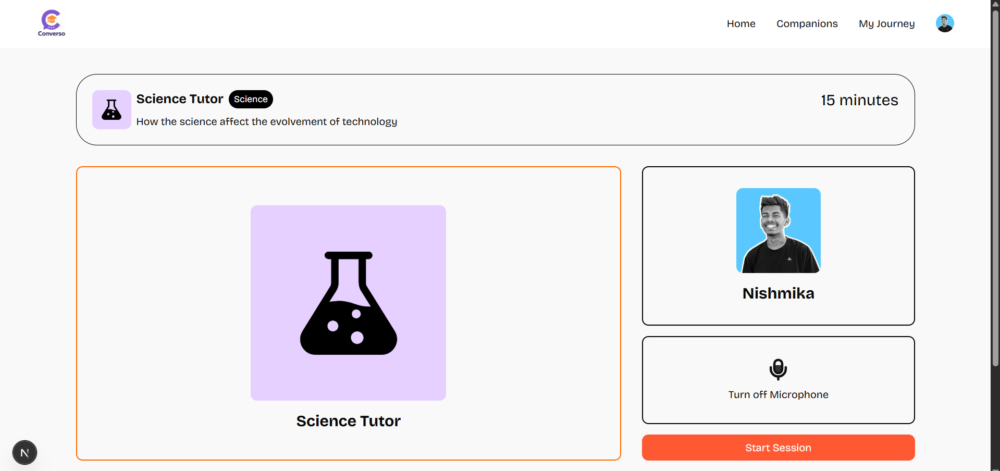
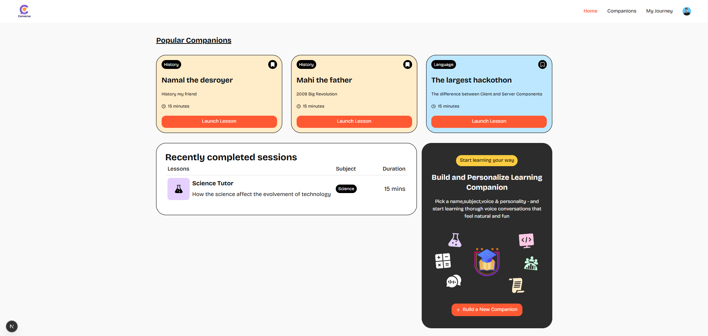
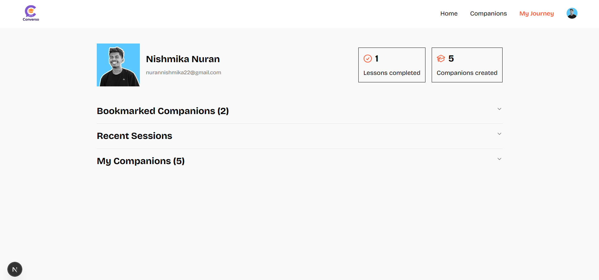
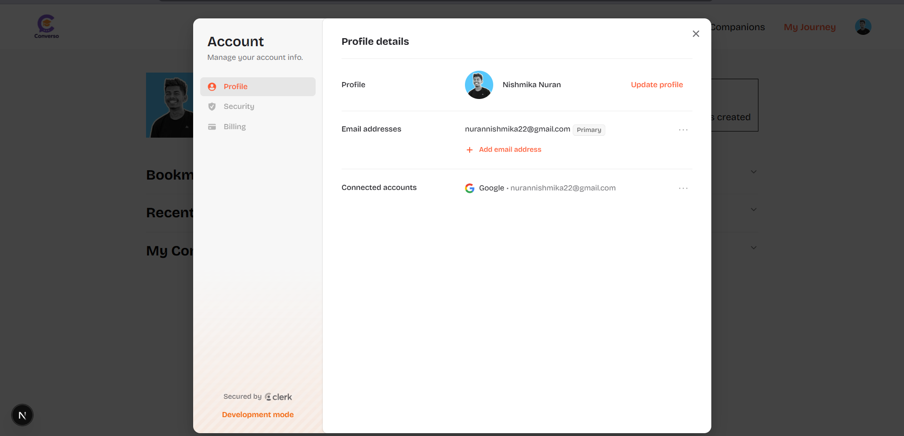

# Converso – AI-Powered Learning Companion

Converso is a powerful **AI learning platform** where users can create custom companions and engage in interactive learning conversations. It’s built with modern tools like **Next.js**, **Supabase**, **Clerk**, **TypeScript**, **Tailwind CSS**, and **shadcn/ui**.

---

## 🚀 Features

- 🗣️ **AI Companions** – Build and personalize companions with unique names, voices, and subjects.
- 📚 **Interactive Lessons** – Launch voice-enabled learning sessions that feel human and engaging.
- 📌 **Bookmarks** – Save your favorite companions to access them anytime.
- 🕒 **Session History** – View completed sessions and revisit what you've learned.
- 💳 **Subscription Plans** – 3-tier billing system (Free, Pro, Premium) with access limits and upgrades.
- 🔐 **Authentication** – Seamless sign-up and login using Clerk Auth.
- 🛠️ **Admin Tools** – Easily manage companions and lesson content via the UI.

---

## 🧱 Tech Stack

| Tech             | Role                            |
| ---------------- | ------------------------------- |
| **Next.js**      | App framework (App Router)      |
| **TypeScript**   | Type safety & dev experience    |
| **Supabase**     | Backend & Database              |
| **Clerk**        | Authentication provider         |
| **Tailwind CSS** | Utility-first styling           |
| **shadcn/ui**    | Beautiful accessible components |
| **Vapi**         | AI voice conversation API       |

---

## 🙌 Acknowledgements

Thanks to the amazing libraries and platforms powering Converso:

- **Supabase**

- **Clerk**

- **Tailwind CSS**

- **shadcn/ui**

- **Vapi**

---

## Preview

